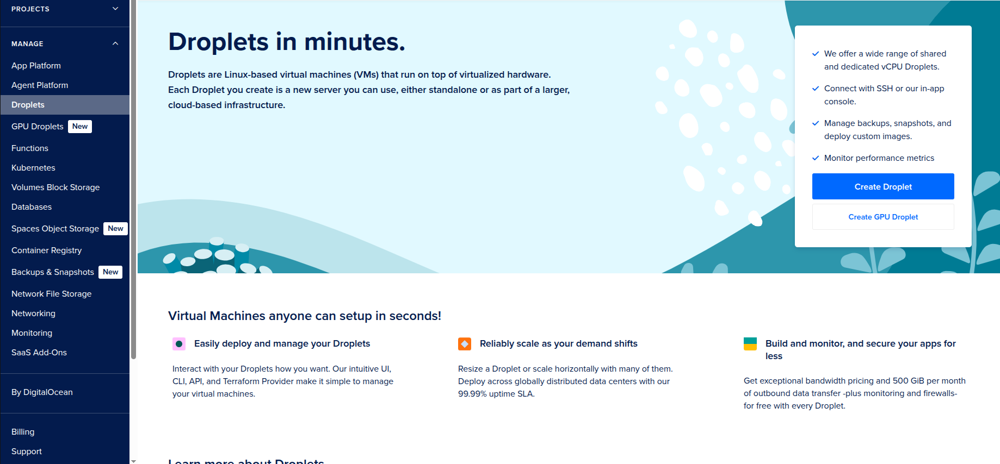
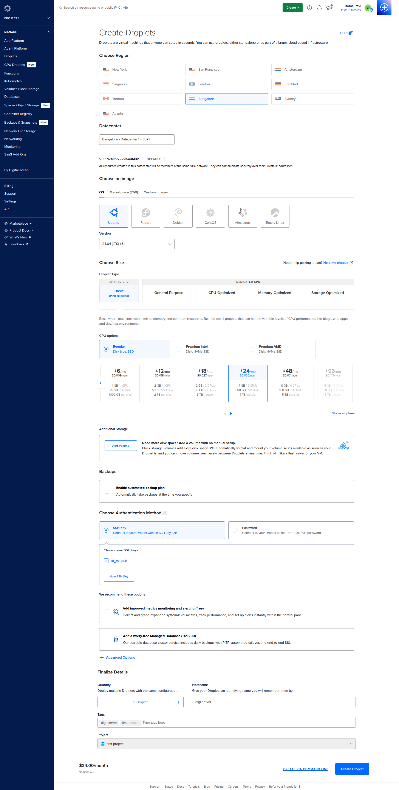
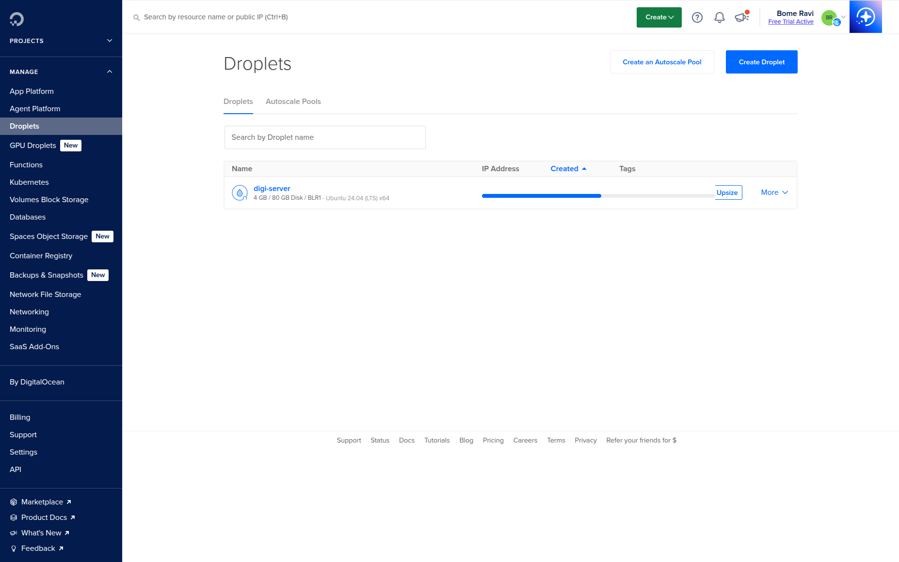
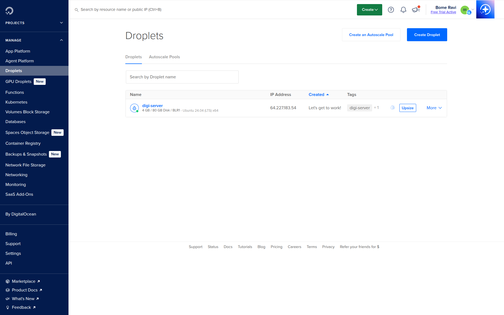
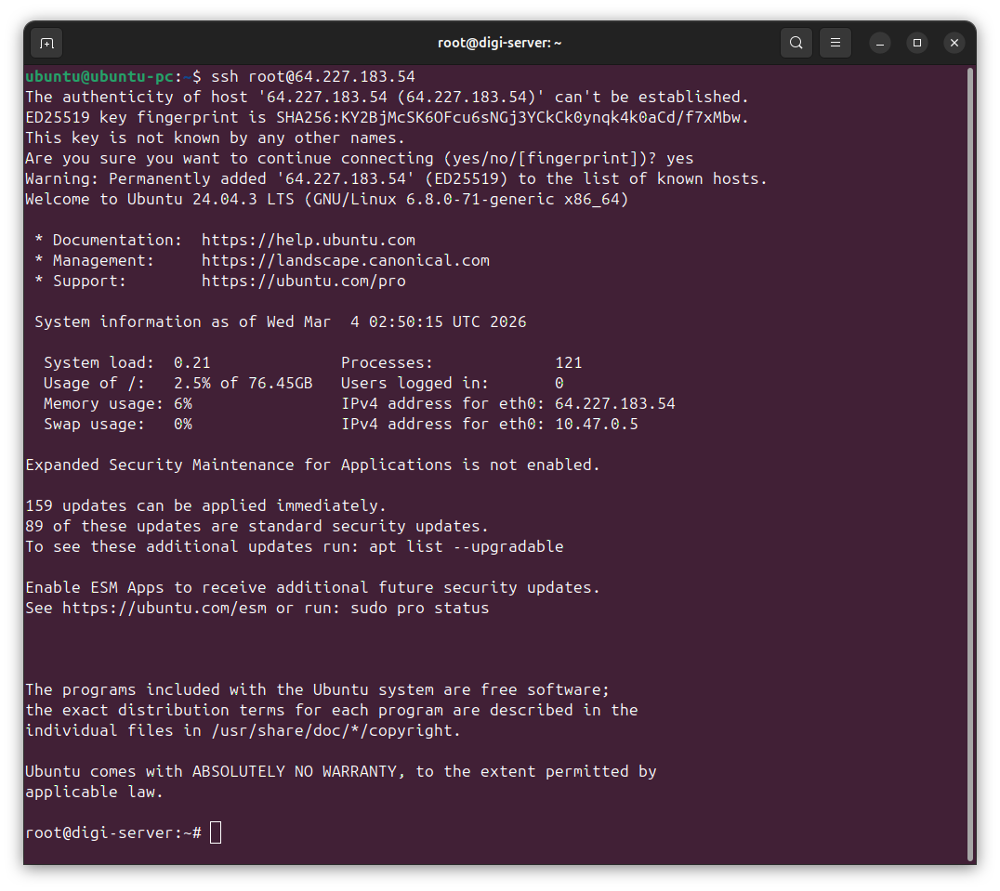
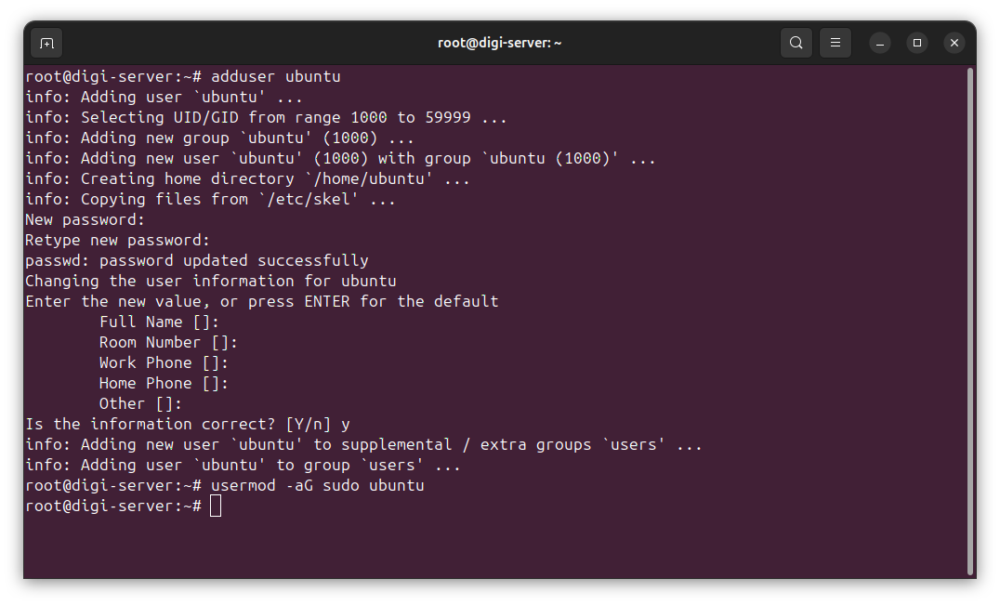
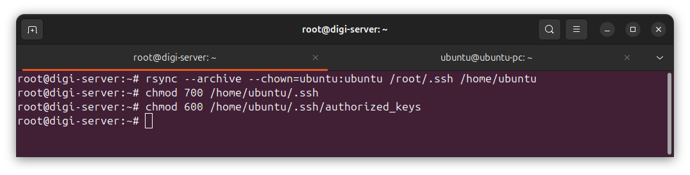

# Create Droplet
Last updated: **March 4, 2026**

This guide walks through creating a Droplet from the DigitalOcean dashboard and completing the initial SSH/user setup.

All screenshots are loaded from `digitalocean/images/droplet/`.

## Prerequisites

- DigitalOcean account with billing enabled
- SSH key pair on your local machine
- Terminal access on your local machine

Generate SSH key if needed:

```bash
ssh-keygen -t ed25519 -C "your-email@example.com"
cat ~/.ssh/id_ed25519.pub
```

## 1. Open Droplets and Start Creation

- Log in to DigitalOcean dashboard.
- Open `Droplets` from the left menu.
- Click `Create Droplet`.



## 2. Configure Droplet Options

On the create form, configure:

- Region and datacenter
- Image (for example `Ubuntu 24.04 LTS`)
- Size/plan (CPU/RAM)
- Authentication method (`SSH Key` recommended)
- Optional: backups, monitoring, tags, hostname

Then click `Create Droplet`.



## 3. Wait for Provisioning

After creation, the Droplet appears in the list and starts provisioning.



## 4. Confirm Droplet Is Ready and Copy Public IP

When status is ready, copy the public IPv4 address.



## 5. SSH Login as Root (First Login)

Connect from your local machine:

```bash
ssh root@<DROPLET_PUBLIC_IP>
```

If your key file is custom:

```bash
ssh -i ~/.ssh/<your_private_key> root@<DROPLET_PUBLIC_IP>
```



## 6. Create a Non-Root Sudo User

Create user and grant sudo access:

```bash
adduser ubuntu
usermod -aG sudo ubuntu
```



## 7. Copy Root SSH Authorized Keys to New User

Copy SSH access so the new user can log in with keys:

```bash
rsync --archive --chown=ubuntu:ubuntu /root/.ssh /home/ubuntu
chmod 700 /home/ubuntu/.ssh
chmod 600 /home/ubuntu/.ssh/authorized_keys
```



## 8. Verify New User Login

From local machine, open a new terminal and test:

```bash
ssh ubuntu@<DROPLET_PUBLIC_IP>
```

If successful, you can continue hardening:

- [Disable Root Login](../ssh/disable-root-ubuntu.md)

## Optional Initial Updates

```bash
sudo apt update && sudo apt upgrade -y
```

