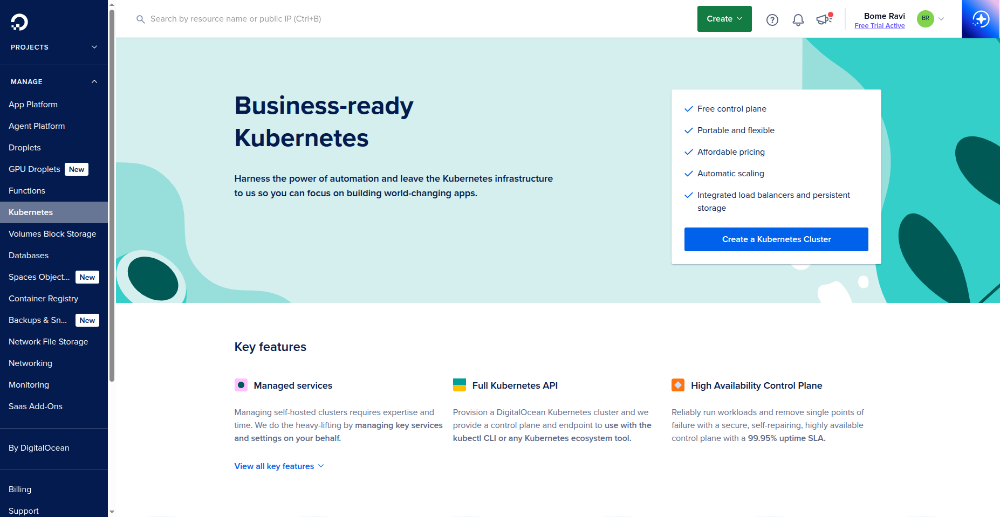
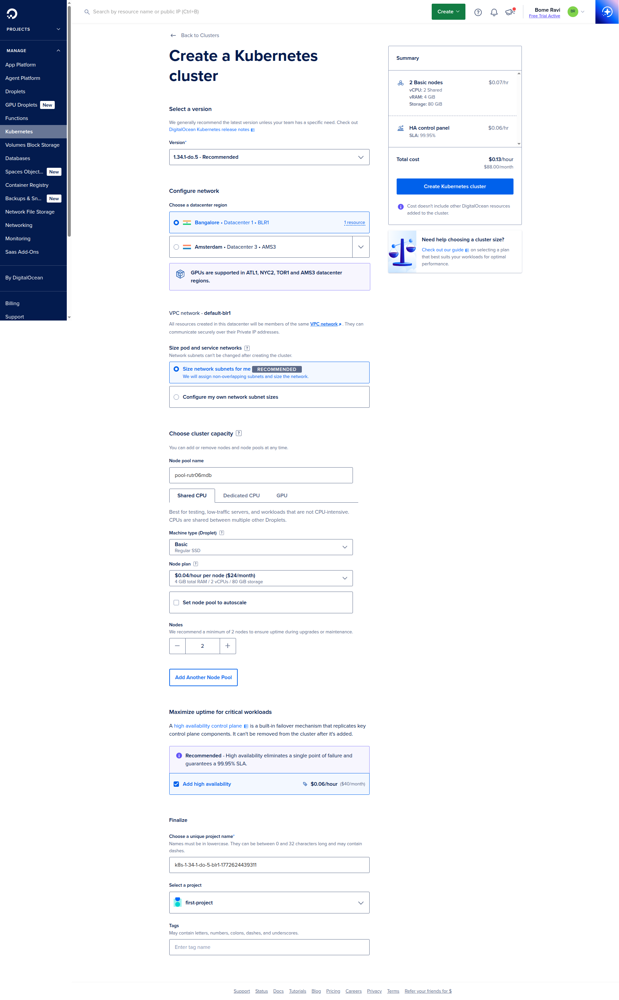
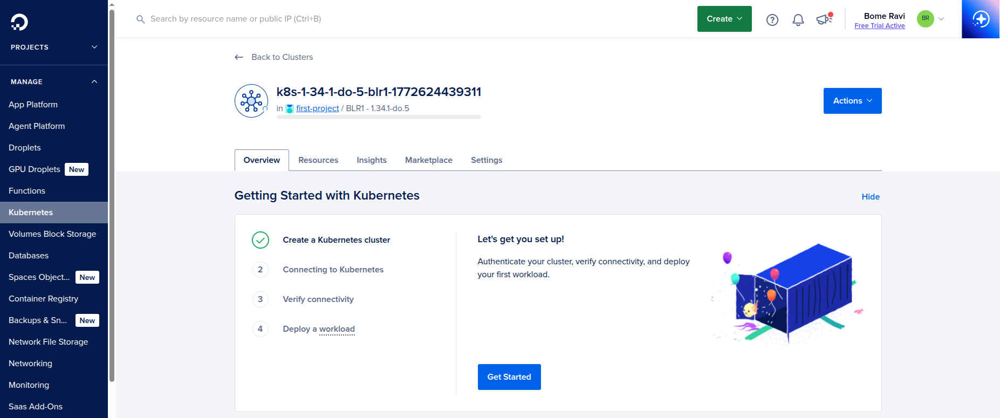
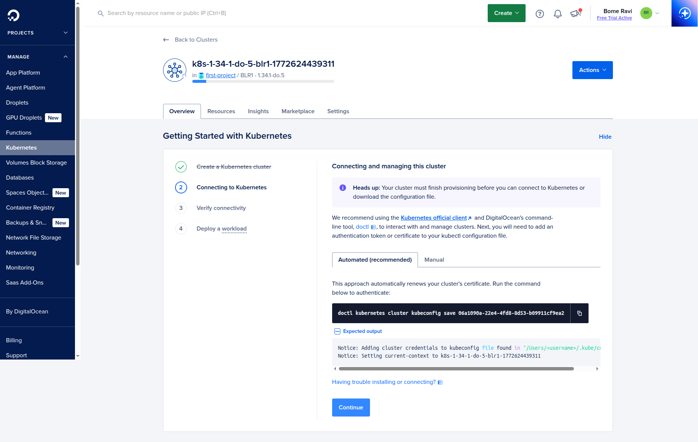
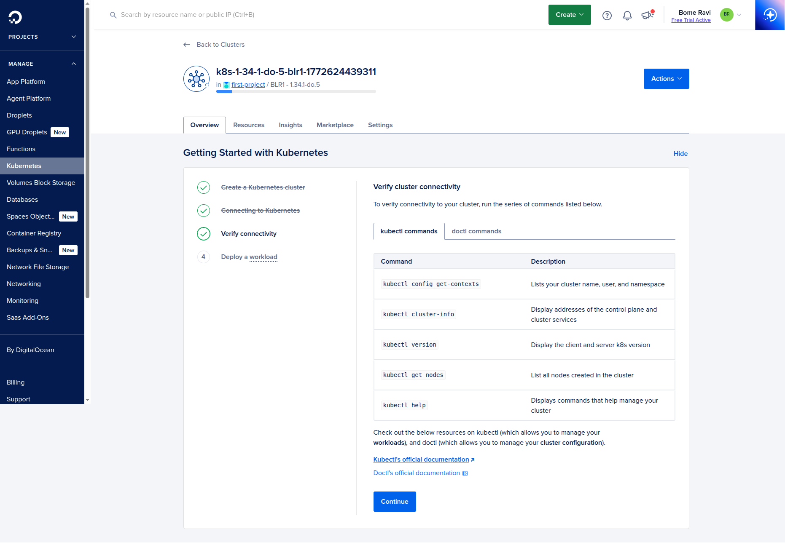
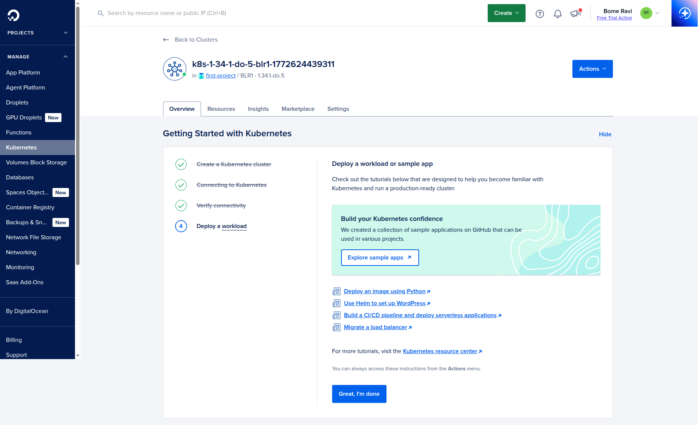
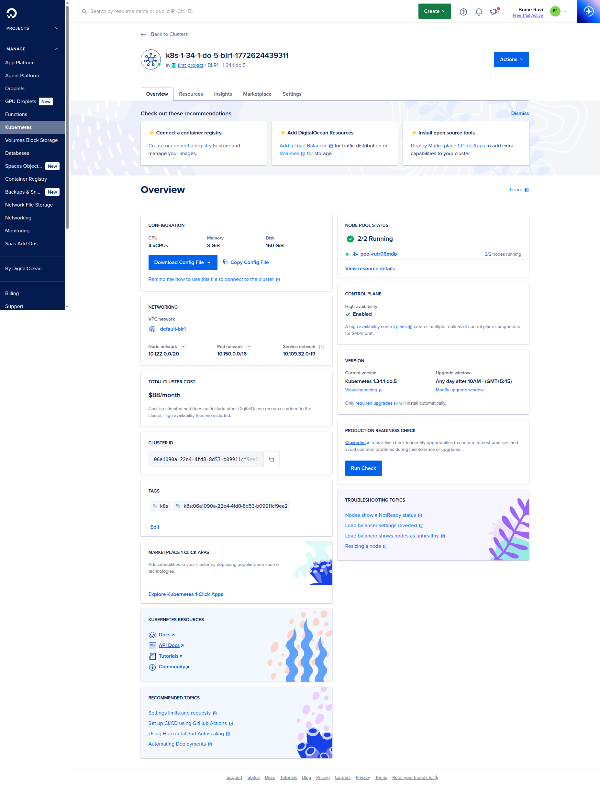

# Kubernetes on DigitalOcean (DOKS)
Last updated: **March 4, 2026**

This guide follows the DigitalOcean UI flow to create and connect a Kubernetes cluster.

All screenshots are loaded from `digitalocean/images/kubernetes/`.

## Prerequisites

- DigitalOcean account with billing enabled
- A project where the cluster will be created
- A terminal/Droplet where you can run `doctl` and `kubectl`

## 1. Open Kubernetes and start cluster creation

- Open DigitalOcean dashboard.
- Go to `Kubernetes` and click `Create a Kubernetes Cluster`.
- You can also click `Create` from the top menu, then select `Kubernetes`.



## 2. Create Kubernetes Cluster

- Configure cluster options.
- If needed, enable `High Availability`.
- Choose droplet/node plan.
- Click `Create Kubernetes Cluster`.
- Wait until cluster provisioning is complete.



## 3. Open cluster details

- After creation, open the cluster details page.
- In the guided setup flow, click `Next`.



## 4. Connect cluster (Droplet + doctl + kubectl)

- Create or use a Droplet/terminal machine for cluster access.
- Install `doctl` on that machine.
- Install `kubectl`:

```bash
curl -LO "https://dl.k8s.io/release/$(curl -L -s https://dl.k8s.io/release/stable.txt)/bin/linux/amd64/kubectl"
sudo install -o root -g root -m 0755 kubectl /usr/local/bin/kubectl
kubectl version --client
```

- Run the exact command shown by DigitalOcean on this screen (kubeconfig save command).
- After the command succeeds, click `Continue`.



## 5. Verify kubectl and continue

- Verify access from terminal:

```bash
kubectl get nodes
kubectl get ns
```

- If the cluster and nodes are visible, click `Continue`.



## 6. Deployment complete

- On the deployment complete screen, click `Great, I am done`.



## 7. Final cluster detail page

- You will land on the final cluster detail page.
- From here, you can manage node pools, upgrades, networking, and access settings.



## Next Step

- Continue with [Kubernetes installation and commands](../kubernetes/kubernetes-installation-and-commands.md).
