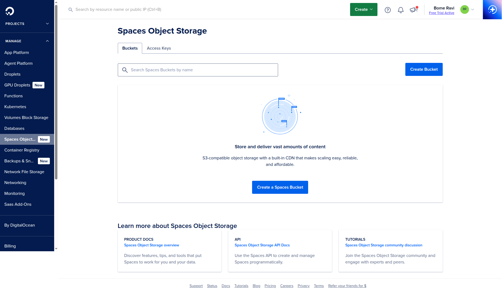
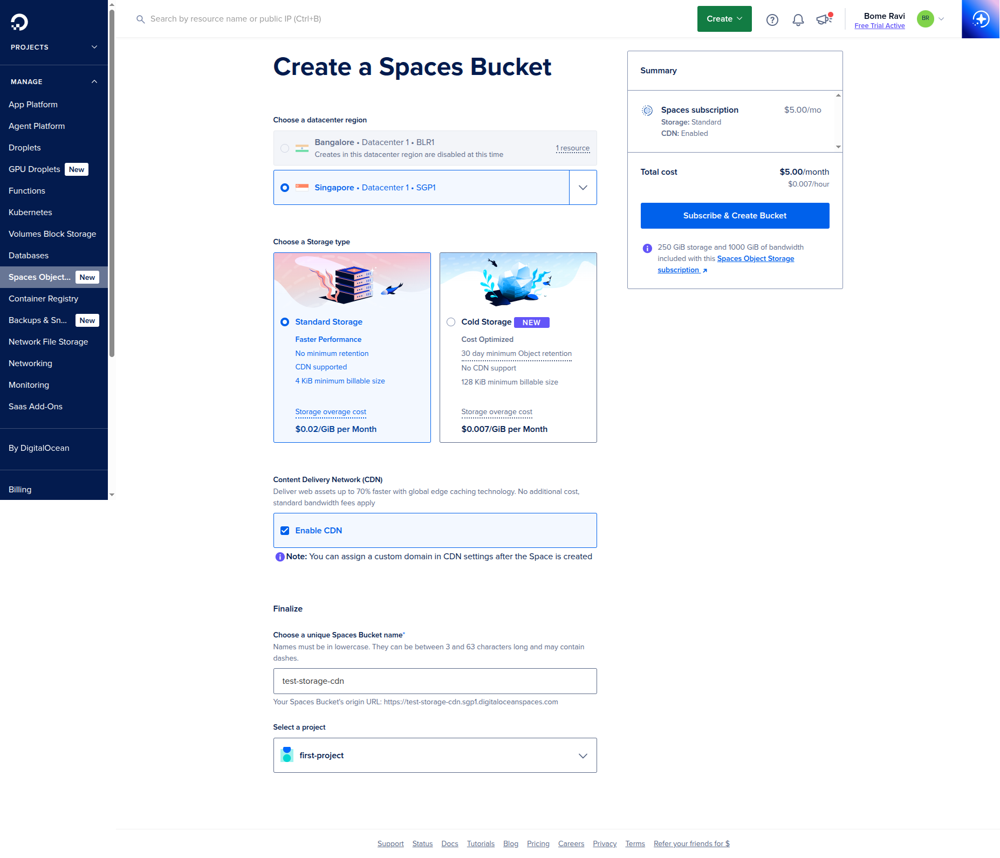
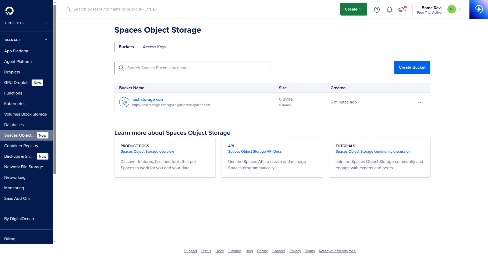
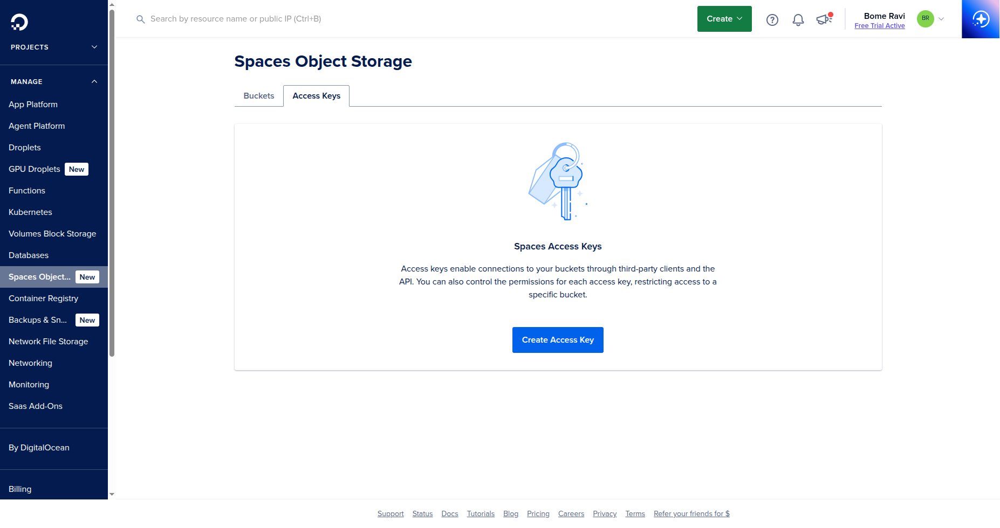
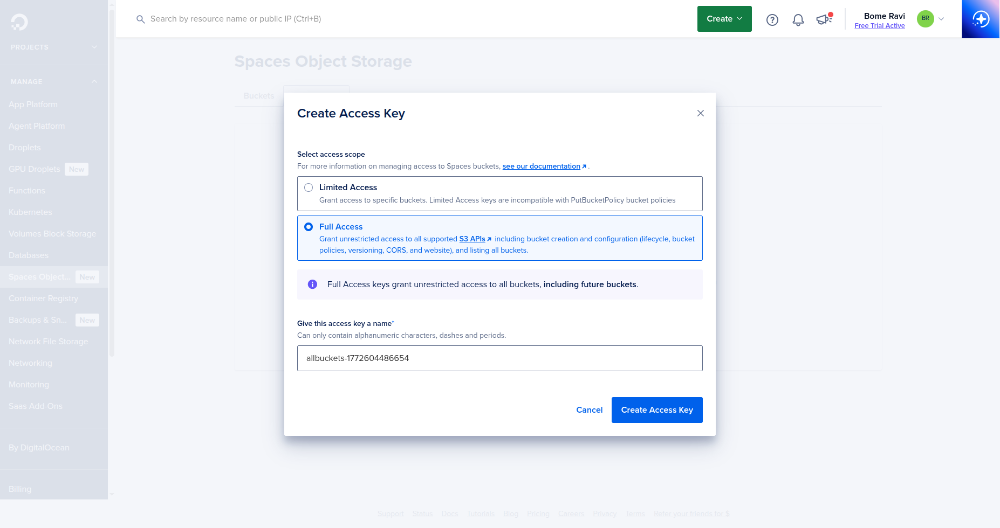
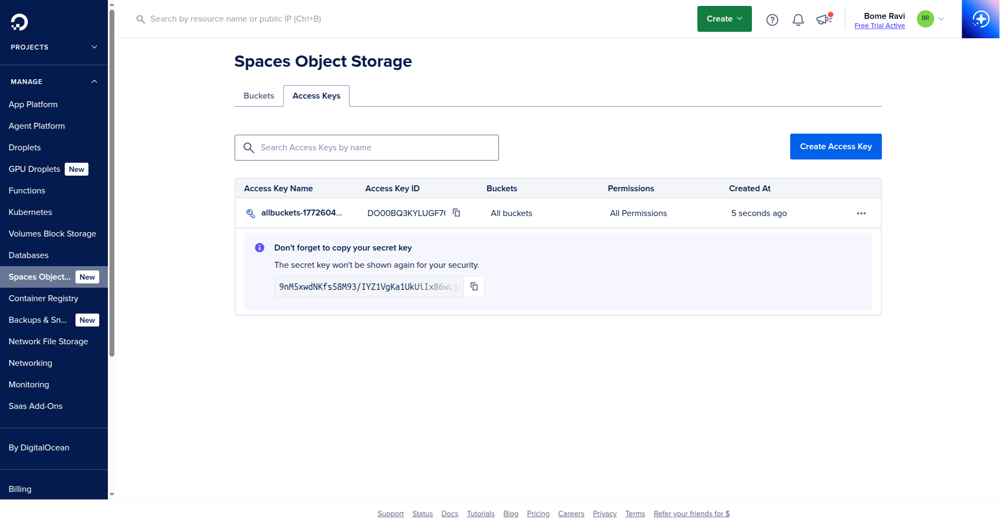
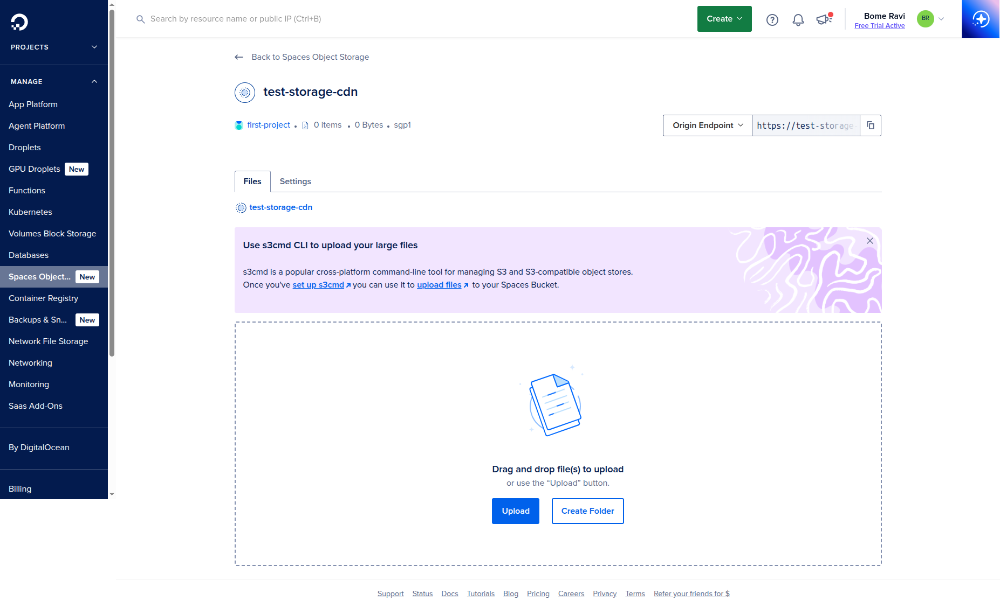

# Space Object Storage (DigitalOcean Spaces)
Last updated: **March 4, 2026**

This guide covers creating and connecting a DigitalOcean Spaces bucket for file/object storage.

All screenshots are loaded from `digitalocean/images/bucket/`.

## Prerequisites

- DigitalOcean account with billing enabled
- A project where the Space will be created

## 1. Open Spaces Object Storage

- Open DigitalOcean dashboard.
- Go to `Spaces Object Storage` from the left sidebar.



## 2. Create a New Space

- Click `Create Bucket` (or `Create a Spaces Bucket`).
- Select:
  - Datacenter region (pick close to your app server)
  - Space name (globally unique)
  - Access type (`Restrict File Listing` for private-by-default)
- Click `Create Space`.



After creation, verify your bucket appears in the list.



## 3. Generate Access Keys

- In dashboard, open `API` -> `Spaces Keys`.
- On the `Access Keys` tab, click `Create Access Key`.



- Select access scope (`Limited Access` or `Full Access`) based on your app needs.
- Name the key and click `Create Access Key`.



- Save:
  - `Access Key`
  - `Secret Key` (shown once)



## 4. Test Access from Browser

- Open your bucket from the `Buckets` tab.
- In the `Files` tab, click `Upload`.
- Select a small test file from your computer.
- Confirm the file appears in the bucket list after upload.



## 5. App Configuration

Set these environment variables in your app/deployment:

```bash
SPACES_KEY=<ACCESS_KEY>
SPACES_SECRET=<SECRET_KEY>
SPACES_BUCKET=<SPACE_NAME>
SPACES_REGION=<REGION>
SPACES_ENDPOINT=https://<REGION>.digitaloceanspaces.com
```

## 6. Optional: Public File Access

- Keep bucket private by default.
- Use signed URLs for protected files.
- For public assets (images/css/js), configure bucket policy or per-object ACL carefully.

## 7. Optional: CDN

- Open your Space settings.
- Enable CDN endpoint if you need global caching.
- Update your app asset URL base to CDN URL.

## Next Step

- If your app server is a Droplet, complete [Droplet setup](./droplet.md) first.
