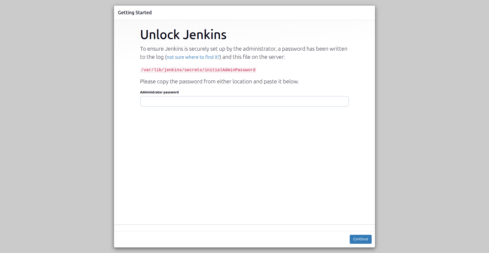
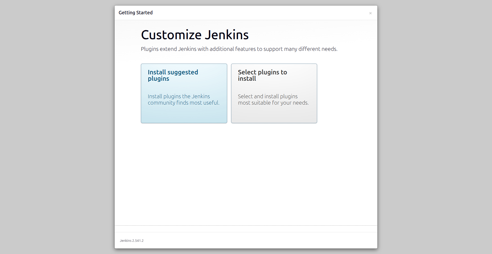
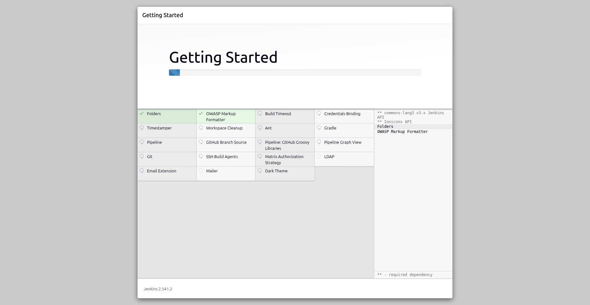
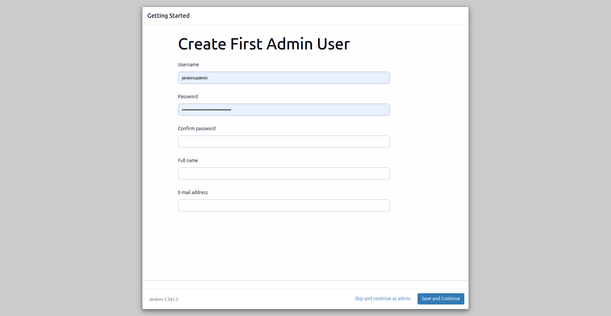
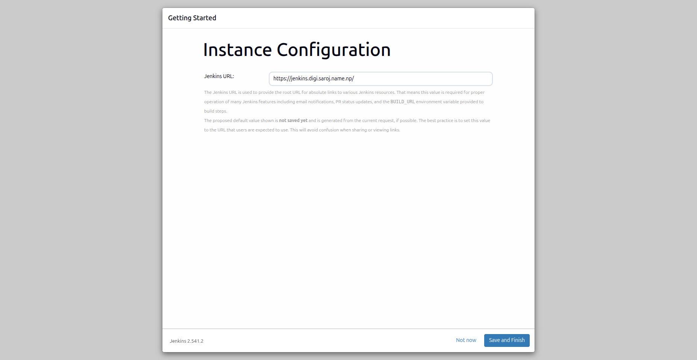
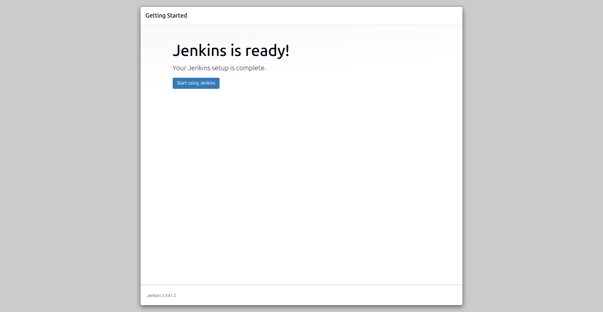
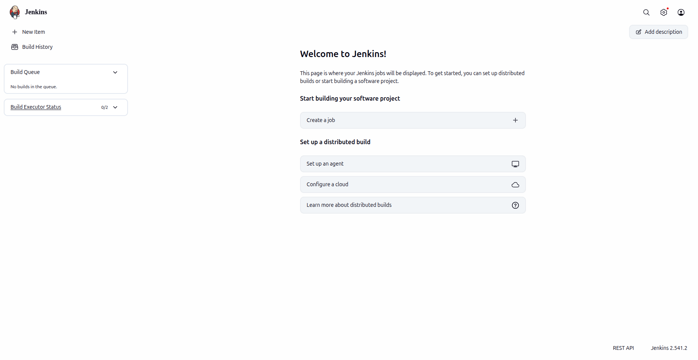

# Jenkins Server Setup

After Jenkins is installed and running, complete the first-time setup from the browser.

## 1) Open Jenkins URL

Visit:

https://jenkins.digi.saroj.name.np



## 2) Unlock Jenkins with the initial admin password

On the server, get the initial unlock password:

```bash
sudo cat /var/lib/jenkins/secrets/initialAdminPassword
```

Copy the password, paste it into the unlock screen, and click **Continue**.

## 3) Install suggested plugins

On the **Customize Jenkins** page, click **Install suggested plugins**.



## 4) Wait for package/plugin installation

Jenkins will download and install required packages and plugins. Wait for this to complete.



## 5) Create the first admin user

Fill in the admin user details (username, password, full name, and email), then continue.



## 6) Configure Jenkins instance URL

On **Instance Configuration**, confirm the URL:

`https://jenkins.digi.saroj.name.np/`

Then click **Save and Finish**.



## 7) Jenkins is ready

On the ready screen, click **Start using Jenkins**.



## 8) Verify Jenkins homepage

You should now see the Jenkins dashboard/homepage.



## Recommended next steps

1. Install pending Jenkins and plugin updates from **Manage Jenkins -> Plugins**.
2. Add required credentials in **Manage Jenkins -> Credentials**.
3. Configure tools/agents needed by your pipelines.
4. Set up regular backups for `/var/lib/jenkins` and keep an off-server copy.
5. For reverse proxy and HTTPS hardening, follow [Apache setup](./apache-setup.md).
6. For credential handling best practices, follow [Secrets guide](./secrets.md).
